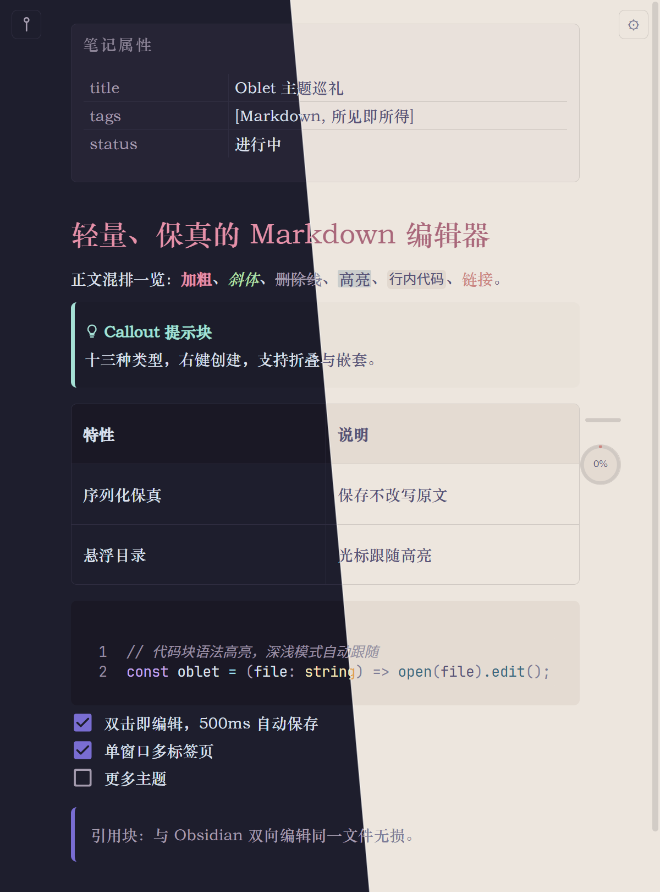
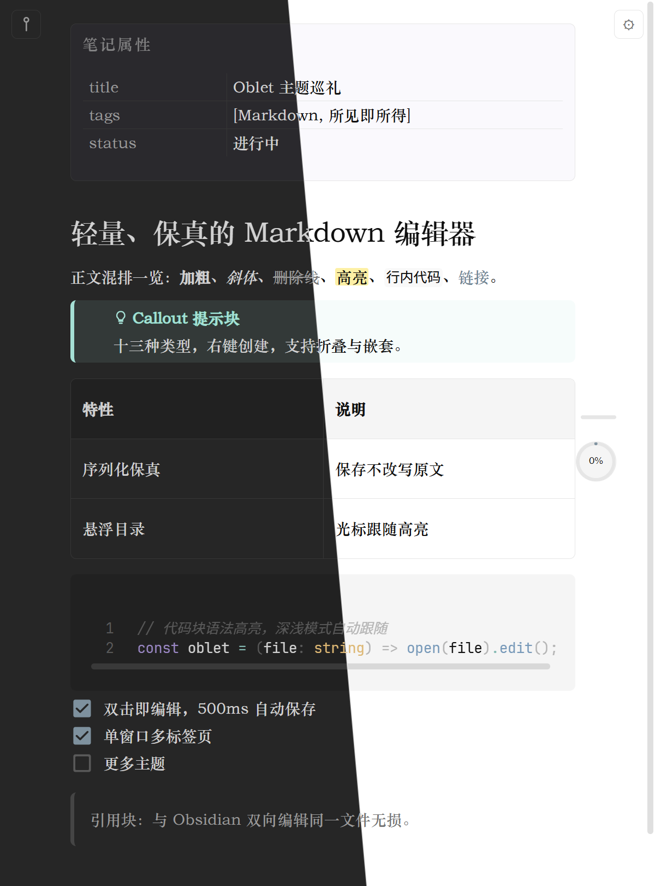
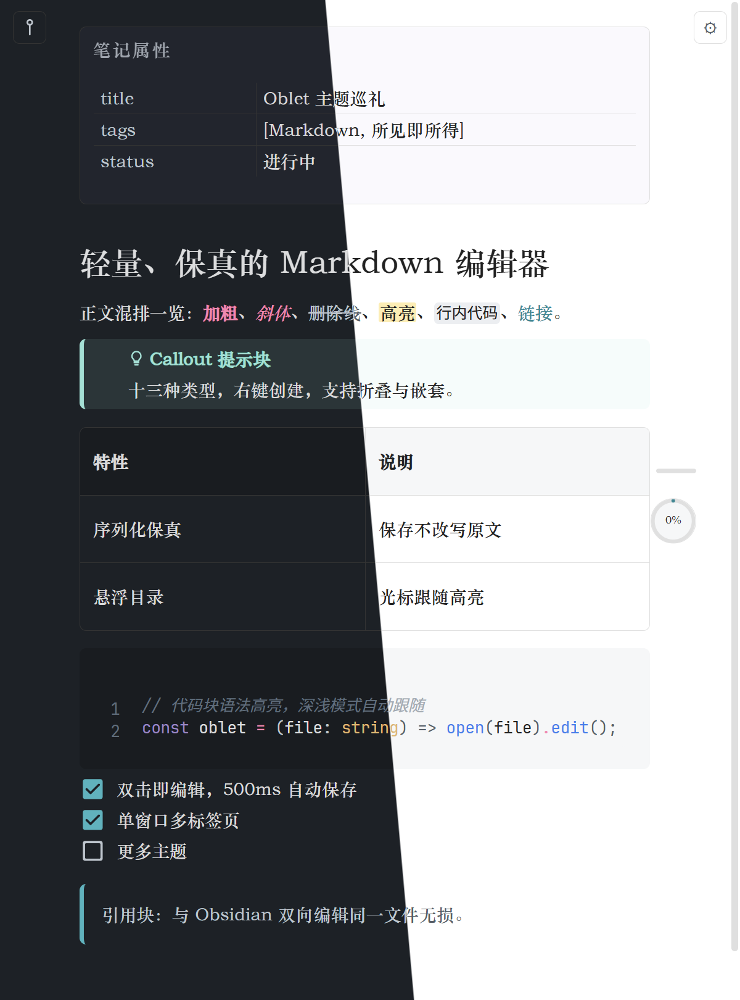
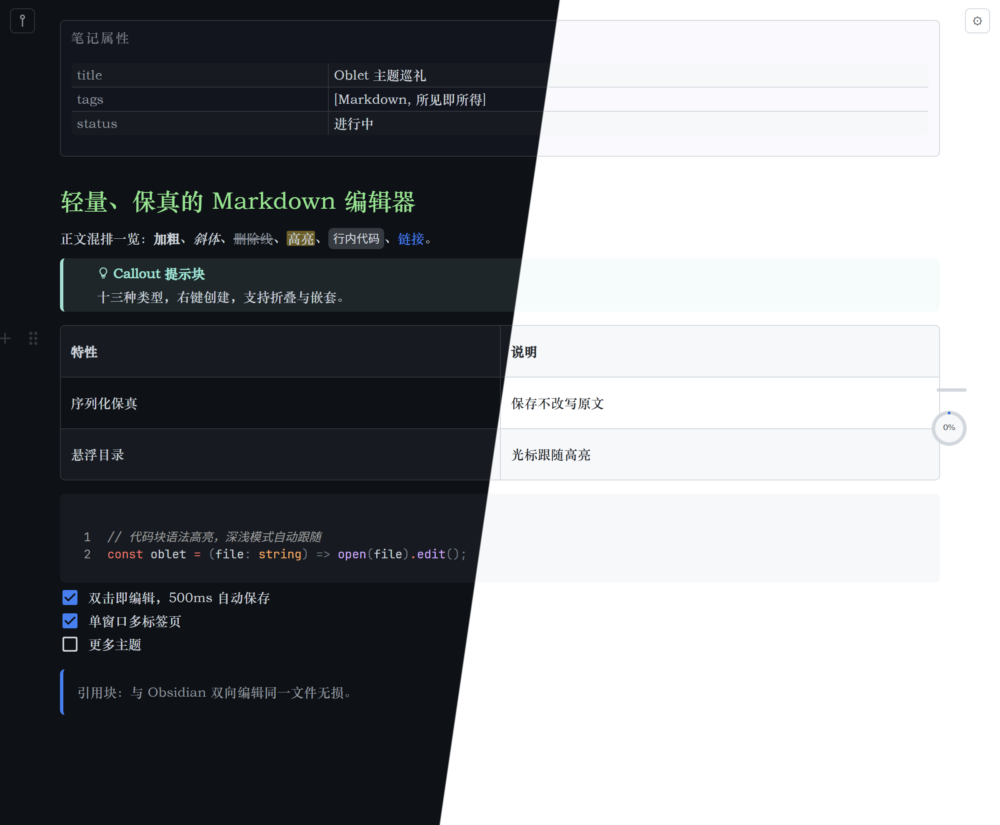
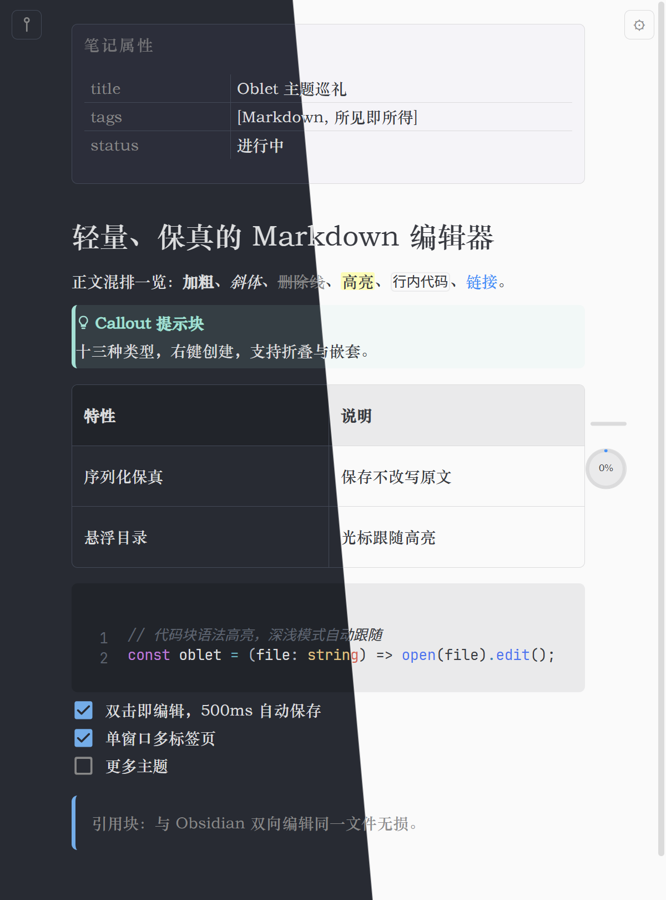
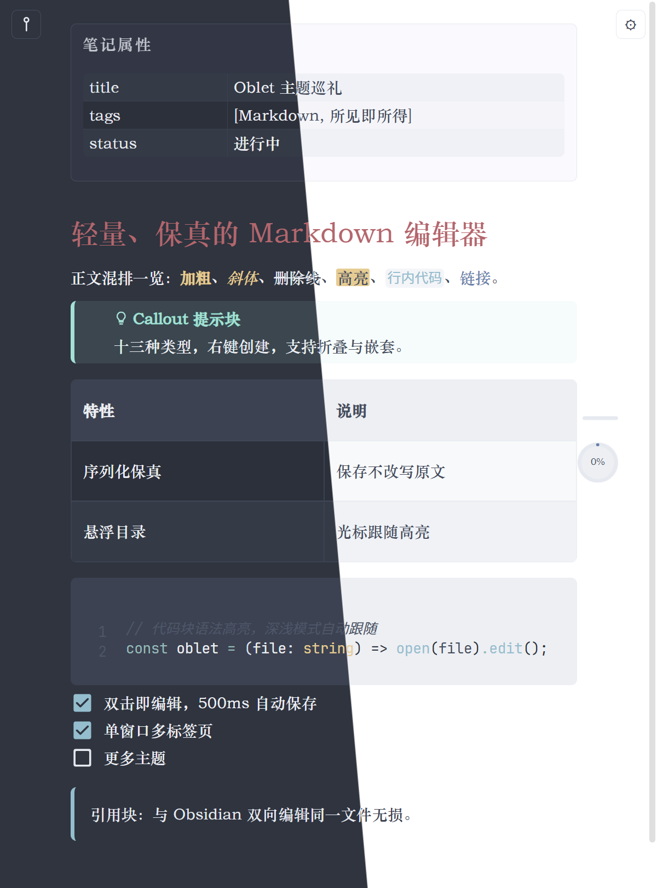

# Oblet


轻量、快速的独立 Markdown 编辑器（Windows）。双击任意 `.md` 文件即开即编辑，支持单窗口多标签页，不需要库（vault）、不需要登录、不收集任何数据。

内置 6 款白名单复刻主题（AnuPpuccin / Minimal / Things / GitHub / Atom / Nord），每款均支持深色 / 浅色 / 跟随系统。第一原则是**序列化保真**：保存不会对你的 Markdown 原文做任何侵入性修改，与 Obsidian 双向编辑同一文件无损。

## 主题

每张截图左半为深色模式，右半为浅色模式。

| AnuPpuccin | Minimal |
| --- | --- |
|  |  |
| **Things** | **GitHub** |
|  |  |
| **Atom** | **Nord** |
|  |  |

## 特性

### 编辑

- 所见即所得：标题、列表、任务列表、表格、代码块语法高亮、KaTeX 块级公式，选中文本可直接拖动移动
- Mermaid 图表：` ```mermaid ` 代码块直接渲染为图（流程图、时序图、甘特图等 20+ 种），配色跟随主题与深浅模式
- 笔记属性：frontmatter 渲染为键值属性栏，可直接编辑
- Callout：13 类 Obsidian 风格提示块，右键菜单一键创建、切换、回退
- 高亮：`==文本==` 语法，渲染时隐藏标记
- 检索与替换：全文档高亮、循环跳转、逐个或全部替换

### 文件与窗口

- 双击即编辑：注册为 `.md` 处理程序后，双击文件直接打开
- 多标签页：拖入多个文件在同一窗口内切换，标签页间缓存内容与光标位置
- 右键新建：文件夹空白处右键新建 Markdown 文档并直接打开
- 自动保存：500ms 防抖，原子写入，换行符跟随原文件
- 外部变更监听：文件被外部修改时自动重载，有未保存内容则提示，绝不静默覆盖
- 只读保护：非 UTF-8 文件以只读方式打开，绝不乱码写回
- 导出：保存至 Obsidian Vault 文件夹，或导出为 PDF
- 窗口置顶：置顶态按钮高亮主题色
- 绿色便携：单 exe 解压即用，设置存于 exe 同级 `data/settings.json`

### 外观

- 6 款主题 × 深浅双模，Ctrl+T 切换深浅
- 悬浮目录：收起态为进度球与层级指示条，悬停展开标题面板，点击跳转，当前位置跟随光标高亮
- 个性化：字体字号、光标所在块底色、代码块自动换行、自定义快捷键

## 下载与使用

系统要求：Windows 10 / 11。

1. 从 [Releases](https://github.com/lnabc03/Oblet/releases) 下载 `Oblet-x.y.z-win-x64.zip`，解压到任意位置
2. 注册右键集成（可选）：以管理员身份运行 `register-md.bat`，将 `.md` 关联到 Oblet 并注册右键新建菜单；`unregister-md.bat` 一键撤销
3. 双击任意 `.md` 文件，或将文件拖入 Oblet 窗口

### SmartScreen 提示

首次运行 Windows 可能弹出"Windows 已保护你的电脑"：因为 exe 没有付费代码签名证书。点击"更多信息"→"仍要运行"即可。源码全部公开，可自行构建验证。

### 自行构建

```bash
npm install
npm run tauri dev     # 开发模式（热重载）
npm run tauri build   # 产出 src-tauri/target/release/oblet.exe
```

需要 Node.js 18+ 与 Rust 工具链（Tauri 2 前置条件见官方文档）。

## 快捷键

| 快捷键        | 功能           |
| ---------- | ------------ |
| Ctrl+S     | 立即保存         |
| Ctrl+P     | 导出为 PDF      |
| Ctrl+O     | 保存至 Obsidian |
| Ctrl+F     | 检索 / 替换      |
| Ctrl+D     | 选中当前行        |
| Ctrl+T     | 切换深浅模式       |
| Ctrl+/     | 设置           |
| Alt+P      | 窗口置顶         |
| Alt+Left   | 上一个标签页       |
| Alt+Right  | 下一个标签页       |
| Ctrl+B     | 加粗           |
| Ctrl+I     | 斜体           |
| Ctrl+K     | 删除线          |
| Ctrl+\`    | 行内代码         |
| Ctrl+H     | 高亮           |
| Alt+A      | Callout 包裹   |
| Alt+1 \~ 6 | 一至六级标题       |

标题键位固定为 Alt+1\~6，其余组合均可在设置中自定义：点击组合键后按新键位，Esc 取消，双击恢复默认。

## 许可与致谢

- Oblet 源码以 [GPL-3.0](LICENSE) 发布（Copyright © 2026 弋鹓 | lnabc03）：因包含 GPL-3.0 许可的 AnuPpuccin 衍生样式，整体按 GPL-3.0 授权
- 内置主题（白名单复刻，均保留版权头与出处声明）：
  - [AnuPpuccin](https://github.com/AnubisNekhet/AnuPpuccin)，GPL-3.0，作者 AnubisNekhet
  - [Minimal](https://github.com/kepano/obsidian-minimal)，MIT，作者 Steph Ango (@kepano)
  - [Things](https://github.com/colineckert/obsidian-things)，MIT，作者 @colineckert
  - [GitHub Theme](https://github.com/krios2146/obsidian-github)，MIT，作者 @krios2146
  - [Atom](https://github.com/kognise/obsidian-atom)，MIT，作者 kognise
  - [Obsidian Nord](https://github.com/insanum/obsidian_nord)，MIT，作者 insanum
- 悬浮目录外观参考自 Obsidian 插件 [Next TOC](https://github.com/Raven-Pensieve/obsidian-next-toc)（GPL-3.0），作者 RavenHogWarts
- 构建于 [Milkdown](https://milkdown.dev/)、[CodeMirror](https://codemirror.net/)、[KaTeX](https://katex.org/)、[Tauri](https://tauri.app/) 之上
- 发行包 `licenses/` 目录内含全部第三方许可文本

作者：弋鹓 | [lnabc03](https://github.com/lnabc03)
