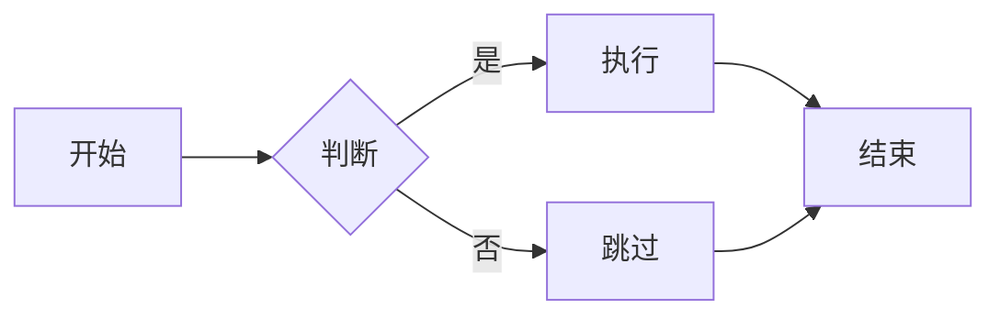

# 一级标题 H1

## 二级标题 H2

### 三级标题 H3

#### 四级标题 H4

普通段落：The quick brown fox jumps over the lazy dog。敏捷的棕色狐狸跳过懒狗。**加粗文本**、*斜体文本*、***粗斜体***、~~删除线~~、==高亮文本==、`行内代码 code`。

> 引用块：这是一段引用。
> 多行引用的第二行。
>
> > 嵌套引用。

---

## 列表

无序列表：

- 项目一
- 项目二
  - 嵌套子项 A
  - 嵌套子项 B
- 项目三

有序列表：

1. 第一步
2. 第二步
3. 第三步

任务列表：

- [x] 已完成任务
- [ ] 未完成任务
- [ ] 移动端适配验证

## 代码块

```rust
fn main() {
    let msg = "Hello, Oblet Android!";
    println!("{}", msg);
}
```

```python
def fib(n):
    return n if n < 2 else fib(n - 1) + fib(n - 2)
```

## 表格

| 功能 | 桌面端 | 安卓端 |
| ---- | ------ | ------ |
| 编辑 | ✅ | ✅ |
| 长按菜单 | 右键 | ✅ |
| 导出 PDF | ✅ | 待验证 |

## Callout

> [!note] 提示
> 这是一个 note callout，验证移动端渲染。

> [!warning] 警告
> 这是一个 warning callout。

> [!tip]- 可折叠提示
> 折叠内容：点击标题展开/收起。

## Mermaid 图



## 链接与图片

外部链接：[Tauri 官网](https://tauri.app)

维基链接：[[test]]

图片（标准 markdown 语法）：


## 数学公式（如支持）

行内公式：$E = mc^2$

块级公式：

$$
\int_{-\infty}^{\infty} e^{-x^2} dx = \sqrt{\pi}
$$

## 长段落滚动测试

春眠不觉晓，处处闻啼鸟。夜来风雨声，花落知多少。这段文字用于测试移动端长段落的排版、行高与字体渲染效果。重复几遍以形成足够长的段落，观察换行和滚动是否流畅。春眠不觉晓，处处闻啼鸟。夜来风雨声，花落知多少。春眠不觉晓，处处闻啼鸟。夜来风雨声，花落知多少。

脚注测试：这是一段带脚注的文字。[^1]

[^1]: 这是脚注内容。
